# 毕业生信息追踪系统
基于Web的毕业生信息追踪系统，能够帮组管理毕业生就业信息。设计和开发的毕业生信息追踪系统在满足上述要求之后，还增加安全编码和安全测试。

## 技术原理
毕业生信息追踪系统全栈是基于JavaScript语言开发，后端使用了NodeJS + Express 4.13.1 框架 + MongoDB，并且使用了log4js日志记录，前端使用了Backbone.js框架，数据可视化使用了D3.js库，在系统Demo测试过程中使用了Nginx代理，配置了Https加密通信。系统在功能上实现了一个RESTfu架构的Json服务器，同时还包含了图片上传、验证码、毕业生信息可视化、模糊查找、日志文件等。系统后台的开发用户登录使用了LocalStrategy验证，验证码采用了CCAP验证码生成库，与数据库连接使用了Mongoose组件。

## 安全功能
系统前端登录界面添加了虚拟键盘，防止键盘记录木马记录，与服务器的进行交互使用了Https保证数据的安全性，同时使用了log4js记录服务器日志，系统对用户的输入都进行了相应的过滤，防止XSS，在Mongoose中对用户的数据进行了验证。

## 效果图

#### 主页
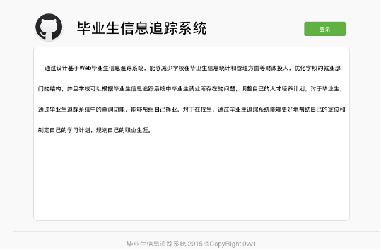

#### 登录页面
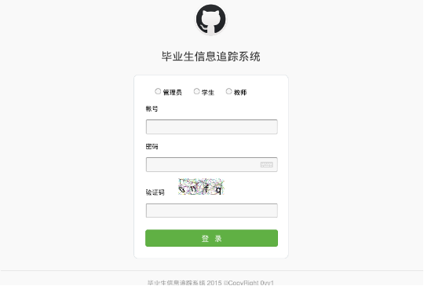

##### 选择虚拟键盘
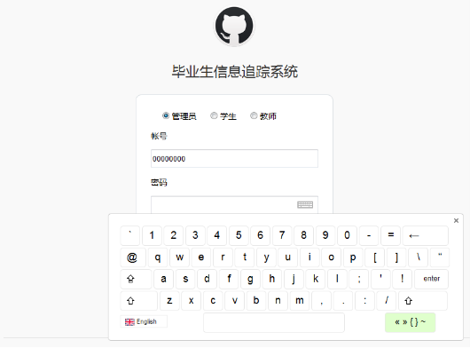

#### 管理员界面
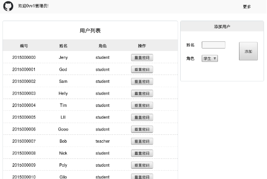

#### 学生界面
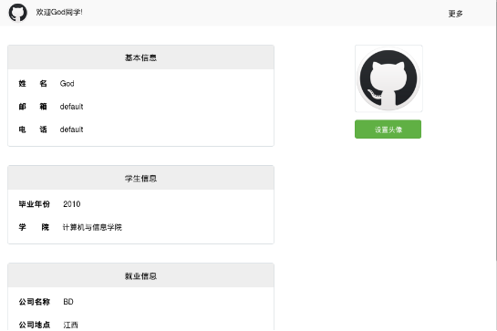

#### 教师界面
##### 默认统计所有学生数据并可视化
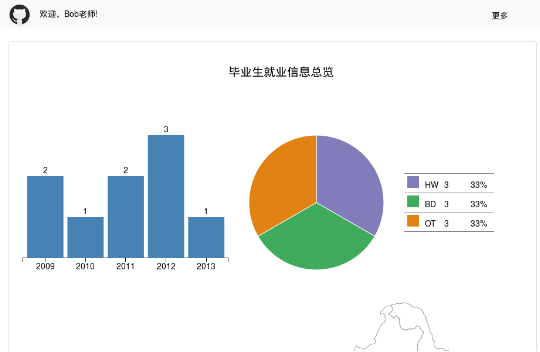
##### 按毕业生毕业时间进行统计并可视化
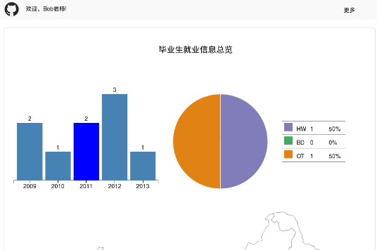
##### 按毕业生就业公司进行统计并可视化
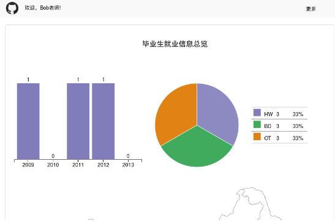
##### 按毕业生就业地点进行统计并可视化
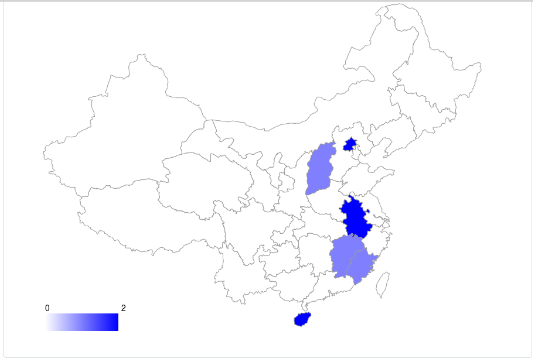
##### 按教师输入进行实时检索
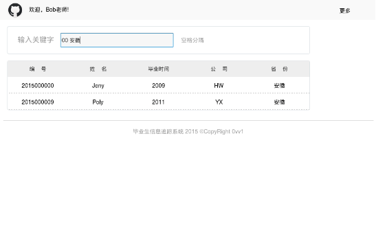

#### 日志输出
##### log4js日志输入
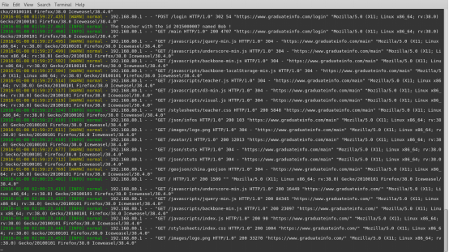
